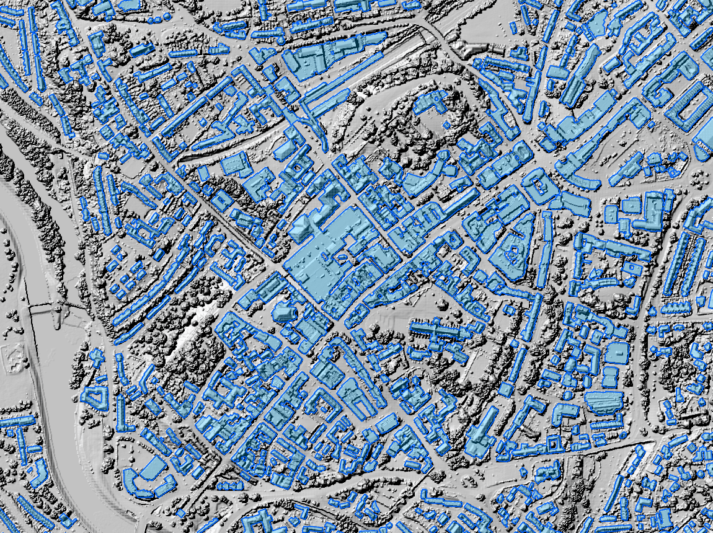
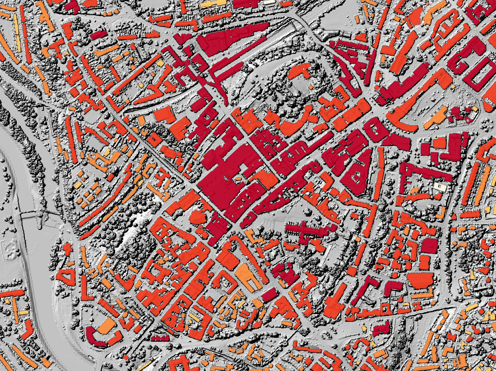

# Building footprints and heights from LiDAR: Exeter case study

Can open LiDAR elevation data produce building footprints that compete with the
freely available footprint datasets? This project extracts footprints, each
with its roof height, for a
100 km² test area over Exeter, UK (OS grid square **SX99**) from the Environment
Agency's 1 m DSM and DTM, with Sentinel-2 imagery as a vegetation signal, and
scores them against Ordnance Survey's detailed building data alongside three
free alternatives: **Microsoft Global ML Building Footprints**,
**OpenStreetMap** and **OS Open** buildings.

**[Live 3D demo](https://petersolan.github.io/LiDAR-Building-Footprints/)**: all 12,654 footprints extruded by roof height.

**In short:** on area the LiDAR footprints score highest of the free datasets
(F1 0.836, against 0.808 for OSM and 0.782 for Microsoft), in every quadrant,
each scored by a model that never saw it, and 94% of them sit on a real
building. Their weak point is shape: neighbouring buildings often merge into
one footprint, so object-level scores trail the other datasets. Unlike the
free datasets, every footprint also has a height: the maximum is within 2 m of
OS's for 88% of buildings (median error 0.65 m).



*Central Exeter: the footprints (blue) over a hillshade of the LiDAR surface
model. Trees show as rough texture in the hillshade and are left out; the
river Exe is on the left. Only open data is drawn here: the OS ground truth
used for scoring can't be redistributed.*

## Contents

- [Method](#method)
- [How it is evaluated](#how-it-is-evaluated)
- [Results](#results): [headline](#headline), [by quadrant](#by-quadrant),
  [by building type and size](#by-building-type-and-size),
  [classifier](#classifier), [false detections](#false-detections),
  [footprint shape](#footprint-shape), [building heights](#building-heights),
  [limitations](#limitations)
- [Outputs](#outputs) · [Repository layout](#repository-layout) ·
  [Running it](#running-it) · [Data](#data)

## Method

A building stands above the ground and has a smooth, planar roof. Trees also
stand above the ground, but their canopy is rough and green. The method builds
on those properties:

1. **Height above ground (nDSM):** DSM minus DTM. Pixels more than 2.5 m tall
   are kept (`02_prepare_rasters.py`, `03_extract_footprints.py`).
2. **Surface roughness:** the mean absolute Laplacian of the DSM over a
   5 × 5 m window. Planar roofs score low and tree canopy high. Smooth tall
   pixels become building *seeds*.
3. **Grow and tidy:** seeds grow back a few metres into the tall area, which
   recovers roof edges and walls (the height step makes those rough). Holes up
   to 10 m² are filled and tiny blobs dropped. Each connected shape is a
   **candidate** footprint, and must reach 3.5 m at its highest point,
   matching the ground truth's height filter.
4. **Classify** (`09_object_classifier.py`): a gradient-boosting model decides
   building or not for each candidate from 18 features: size, height (mean,
   maximum, spread), roughness, share of smooth roof, Sentinel-2 greenness
   (NDVI mean, minimum, maximum), shape (circularity, rectangularity, solidity,
   elongation, slenderness) and neighbourhood (candidates within 50 m,
   distance to the nearest). It replaced an earlier fixed rule (drop
   footprints under 400 m² with mean NDVI above 0.7).
5. **Bridge rule:** bridges and footbridges look like flat roofs to LiDAR. A
   candidate is dropped when road (OS Open Roads) or railway (OS Open
   Zoomstack) centreline running through it, at least 1 m in from its edge,
   is at least as long as the square root of its area (roughly its width), and
   it is under 5,000 m². Large stations and shopping centres do have roads and
   tracks through them, hence the size limit, which is a fixed design choice:
   with only a few dozen bridges, tuning it let one fold pick 2,000 m² by noise
   and keep the A30 bridge over the M5. The centreline ratio is tuned (every
   fold chose 0.8). Rivers are not used: they also run under real buildings,
   such as mills, and bridges over rivers carry a road anyway.
6. **Minimum size:** candidates under 30 m² are not buildings, the same rule
   as for the ground truth and every other dataset (see below).
7. **Trace and square up** (`08_regularise_footprints.py`): outlines are traced
   between pixel centres, simplified, and each footprint's edges are snapped to
   its dominant orientation and the perpendicular, so corners become right
   angles. If squaring would change a shape by more than 15% (IoU < 0.85), the
   simplified outline is kept instead. Where squared neighbours would overlap,
   the overlap goes to the footprint whose traced outline covered more of it,
   so neighbours can share edges but never overlap.
8. **Heights** (`10_building_heights.py`): the nDSM pixels inside each final
   footprint give its median, 95th percentile and maximum height above
   ground. With the footprint, that is a simple block (LoD1) building model.

The NDVI is a median of clear summer 2022 Sentinel-2 L2A scenes, the same year
as the LiDAR (`07_sentinel2_ndvi.py`). At 10 m it is too coarse to judge
individual roofs, but it reliably flags tree crowns and hedgerows.

**Validation: leave one quadrant out.** The AOI is split into four 5 km
quadrants: **SW** and **SE** urban, **NW** and **NE** rural. For each quadrant,
the classifier is trained, and its probability threshold and bridge rule are
chosen, on the other three, then it predicts the fourth. So every quadrant's
footprints, and every score below, come from a model that never saw that
quadrant. Within the three training quadrants, the threshold and bridge rule
are chosen on out-of-fold predictions (5-fold spatial cross-validation by 1 km
tile). Finally one model is trained on all four quadrants and saved for
mapping other areas. (The extraction parameters in steps 1 to 3 were tuned
earlier on SW and NE.)

An earlier version trained on SW and NE only and held out SE and NW. Using all
four quadrants this way gives the same accuracy (pixel F1 0.829 against 0.831,
area F1 0.836 against 0.838, within the uncertainty): the model had already
learned what these features can tell it, and the scores now show it
generalises to every quadrant, not just two.

## How it is evaluated

**Ground truth** is the OS National Geographic Database building layer. These
OS features become **ignore zones**, where no dataset is rewarded or
penalised: domestic outbuildings, electricity substations, "Unknown Building"
features under 50 m² (larger ones are mostly real buildings OS hasn't
classified, such as farm buildings), and buildings under 3.5 m, without a
recorded height, or **under 30 m²**. Footprints under 30 m² are also left out
of every dataset, so the size rule is the same for all. (A 40 m² limit was
tested too: it removed another ~4,100 OS buildings, mostly real garages, and
lowered object F1 for every dataset.) That leaves **46,437 scored buildings**.

**Metrics** (`04_evaluate.py`):

| Level | Metric | What it answers |
|---|---|---|
| Area | **Precision** | Of the area a dataset maps as building, how much is building? |
| | **Recall** | Of the building area, how much does the dataset map? |
| | **F1** | Harmonic mean of the two: the headline score. It doesn't depend on how a dataset splits a terrace into houses |
| | **IoU** | Overlap ÷ union of mapped and true building area |
| Object | Precision / recall / **F1** | Touching buildings are merged into blocks (a terrace is one block) and matched one to one at IoU ≥ 0.5. Are the *shapes* right, not just the area? |
| Building | **Detected** | Share of OS buildings at least 50% covered: building-level recall |
| | **Footprint precision** | Share of a dataset's footprints with at least 50% of their area on a scored OS building: building-level precision |
| | **Detection F1** | Harmonic mean of the two |
| False detections | Isolated false area, whole false shapes | See [False detections](#false-detections) |

**Uncertainty.** 95% intervals come from a block bootstrap over the 100 1 km
tiles of the AOI: tiles are resampled with replacement 2,000 times and the
scores recomputed, so clustered errors (a whole estate missed, a wood full of
false shapes) widen the interval as they should. The same resamples give a
paired comparison of the LiDAR method against each benchmark.

## Results

### Headline

| Dataset | Area precision | Area recall | **Area F1** (95% interval) | IoU | Object P / R / F1 | Detected (95% interval) | Footprint precision | Detection F1 |
|---|---|---|---|---|---|---|---|---|
| **LiDAR** | 0.823 | 0.849 | **0.836** (0.822–0.849) | 0.718 | 0.658 / 0.367 / 0.471 | 89.2% (85.9–91.8) | 94.2% | 91.6% |
| OpenStreetMap | 0.825 | 0.791 | 0.808 (0.788–0.824) | 0.677 | 0.668 / 0.658 / 0.663 | 90.2% (88.2–91.7) | 94.7% | 92.4% |
| Microsoft | 0.767 | 0.798 | 0.782 (0.765–0.797) | 0.642 | 0.698 / 0.653 / 0.675 | 92.2% (88.9–94.8) | 92.5% | 92.4% |
| OS Open | 0.891 | 0.926 | 0.908 (0.899–0.917) | 0.832 | 0.830 / 0.700 / 0.759 | 98.4% (97.8–98.9) | 97.2% | 97.8% |

**Is the difference real?** Paired bootstrap of area F1, LiDAR minus benchmark:

| Against | F1 difference (95% interval) | Resamples in which LiDAR scores higher |
|---|---|---|
| Microsoft | +0.054 (+0.044 to +0.064) | 100% |
| OpenStreetMap | +0.028 (+0.016 to +0.042) | 100% |
| OS Open | −0.072 (−0.084 to −0.063) | 0% |

- **Area:** LiDAR has the highest recall of the free datasets and OSM-level
  precision, so the best F1. The lead over Microsoft and OSM holds in every
  bootstrap resample. OS Open probably derives from the same OS master data as
  the ground truth, so its lead is expected.
- **Buildings:** LiDAR detects about as many buildings as OSM and Microsoft
  (the intervals overlap), and 94% of its footprints are real buildings, as
  for OSM.
- **Shapes:** object recall is low (0.367) because neighbouring buildings merge
  into one LiDAR footprint: 11,551 LiDAR blocks against 20,708 OS blocks.
  Object precision is close to the others: when LiDAR draws a shape, it is
  usually right.

### By quadrant

LiDAR, all metrics (each quadrant predicted by a model trained on the other three):

| Quadrant | Area P | Area R | **Area F1** | IoU | Object P / R / F1 | Detected | Footprint precision | Detection F1 |
|---|---|---|---|---|---|---|---|---|
| SX99SW (urban) | 0.818 | 0.870 | **0.843** | 0.729 | 0.638 / 0.357 / 0.458 | 93.8% | 94.6% | 94.2% |
| SX99SE (urban) | 0.838 | 0.815 | **0.826** | 0.704 | 0.678 / 0.361 / 0.471 | 77.7% | 94.8% | 85.4% |
| SX99NW (rural) | 0.793 | 0.848 | **0.820** | 0.695 | 0.711 / 0.474 / 0.569 | 89.1% | 88.1% | 88.6% |
| SX99NE (rural) | 0.816 | 0.785 | **0.800** | 0.667 | 0.703 / 0.412 / 0.519 | 80.7% | 92.7% | 86.3% |

All datasets:

| Quadrant | Area F1: LiDAR | MS | OSM | OS Open | Object F1: LiDAR | MS | OSM | OS Open | Detected: LiDAR | MS | OSM | OS Open | Footprint precision: LiDAR | MS | OSM | OS Open |
|---|---|---|---|---|---|---|---|---|---|---|---|---|---|---|---|---|
| SW | **0.843** | 0.796 | 0.813 | 0.905 | 0.458 | 0.732 | 0.654 | 0.774 | 93.8% | 96.1% | 93.2% | 98.8% | 94.6% | 94.7% | 95.4% | 97.8% |
| SE | **0.826** | 0.757 | 0.825 | 0.918 | 0.471 | 0.580 | 0.680 | 0.728 | 77.7% | 81.6% | 85.6% | 97.5% | 94.8% | 91.2% | 93.2% | 97.1% |
| NW | **0.820** | 0.764 | 0.596 | 0.890 | 0.569 | 0.690 | 0.537 | 0.779 | 89.1% | 95.2% | 59.2% | 99.0% | 88.1% | 83.2% | 89.5% | 92.9% |
| NE | **0.800** | 0.749 | 0.772 | 0.901 | 0.519 | 0.546 | 0.741 | 0.746 | 80.7% | 88.5% | 88.5% | 98.4% | 92.7% | 84.1% | 94.4% | 95.7% |

LiDAR leads on area F1 among the free datasets in all four quadrants (in SE by
a hair over OSM). The urban quadrants score a little higher than the rural
ones. OSM's coverage is patchy in rural NW (59% detected), which LiDAR doesn't
depend on. SE has the lowest LiDAR detection rate (78%) even though its area F1
is high, which suggests buildings there are partly rather than wholly missed:
a building counts as detected only if half of it is covered.

### By building type and size

| Class | Buildings | Detected: LiDAR | MS | OSM | OS Open | Area recall: LiDAR | MS | OSM | OS Open |
|---|---|---|---|---|---|---|---|---|---|
| Terraced / semi-detached house | 31,379 | 92.0% | 92.9% | 91.3% | 98.6% | 84.0% | 79.3% | 74.8% | 89.9% |
| Detached house | 6,934 | **78.5%** | 90.0% | 88.8% | 99.1% | 75.4% | 75.8% | 71.4% | 91.9% |
| Flats / other residential | 3,934 | 90.0% | 95.0% | 91.3% | 96.0% | 84.2% | 79.6% | 80.3% | 89.4% |
| Commercial / mixed use | 2,368 | 92.2% | 92.7% | 92.7% | 98.6% | 90.7% | 82.6% | 89.3% | 95.7% |
| Outbuilding / unknown | 1,372 | 69.9% | 77.1% | 64.9% | 97.2% | 79.9% | 75.9% | 66.4% | 94.9% |
| Public / other | 433 | 90.1% | 92.8% | 95.6% | 98.8% | 89.6% | 82.0% | 88.1% | 94.8% |
| Small utility | 17 | 76.5% | 76.5% | 47.1% | 100% | 92.9% | 45.2% | 60.2% | 98.5% |

| Size | Buildings | Detected: LiDAR | MS | OSM | OS Open | Area recall: LiDAR | MS | OSM | OS Open |
|---|---|---|---|---|---|---|---|---|---|
| 30–50 m² | 13,951 | 88.4% | 90.9% | 92.2% | 98.6% | 85.1% | 79.8% | 80.2% | 94.0% |
| 50–200 m² | 29,756 | 89.2% | 92.7% | 89.3% | 98.2% | 80.4% | 77.9% | 72.7% | 89.7% |
| 200–1,000 m² | 2,208 | 92.2% | 93.3% | 88.6% | 99.5% | 87.2% | 81.4% | 80.1% | 92.7% |
| over 1,000 m² | 522 | 94.6% | 91.6% | 95.8% | 99.2% | 90.4% | 81.1% | 88.6% | 96.1% |

Detection is the share of buildings at least half covered; area recall is the
share of their area covered. LiDAR covers the most building area of the free
datasets in every size band and every class except detached houses, where it
is level with Microsoft. It detects fewer detached houses, though, probably
because a house under trees loses roof pixels to the roughness and greenness
tests, leaving less than half of it.

### Classifier

How the building / not-building decision has improved, as pixel F1 per
quadrant on the 1 m grid before squaring (`classifier_pixels.csv`). These
pixel scores differ slightly from the vector scores above, which are computed
on the final squared outlines.

| Method | SW | SE | NW | NE | Mean |
|---|---|---|---|---|---|
| Height and roughness only | 0.832 | 0.810 | 0.691 | 0.714 | 0.762 |
| + fixed NDVI rule (first method) | 0.836 | 0.804 | 0.804 | 0.789 | 0.808 |
| Classifier trained on SW + NE only (earlier scheme) | 0.853 | 0.833 | 0.828 | 0.811 | 0.831 |
| Classifier, leave one quadrant out | 0.850 | 0.827 | 0.826 | 0.801 | 0.826 |
| **+ bridge rule + 30 m² minimum (final)** | **0.851** | **0.831** | **0.827** | **0.806** | **0.829** |

Final method, pixel precision / recall: SW 0.825 / 0.878, SE 0.843 / 0.820,
NW 0.798 / 0.857, NE 0.821 / 0.792.

Candidate level, i.e. is each candidate shape correctly kept or dropped?
(`classifier_candidates.csv`; a candidate counts as a building if more of it
lies on scored OS buildings than outside any OS building; every quadrant
scored by the model that didn't see it):

| Quadrant | Candidates | Buildings among them | ROC AUC | Average precision | Kept and correct | Kept, not a building | Dropped, was a building | Precision | Recall | F1 |
|---|---|---|---|---|---|---|---|---|---|---|
| SW | 8,508 | 6,818 | 0.971 | 0.988 | 6,626 | 227 | 192 | 0.967 | 0.972 | 0.969 |
| SE | 4,314 | 3,418 | 0.958 | 0.984 | 3,229 | 131 | 189 | 0.961 | 0.945 | 0.953 |
| NW | 1,334 | 595 | 0.988 | 0.980 | 568 | 42 | 27 | 0.931 | 0.955 | 0.943 |
| NE | 1,329 | 769 | 0.982 | 0.982 | 736 | 34 | 33 | 0.956 | 0.957 | 0.956 |

The four folds chose thresholds between 0.45 and 0.625, and all chose the same
bridge rule (centreline ratio 0.8). The bridge rule removed 48 candidates
(40,600 m²), two of them mostly real buildings (6,300 m²). The saved
all-quadrant model (`outputs/models/building_classifier.joblib`) uses a
threshold of 0.50. 12,654 of 17,229 candidates are kept
(`classifier_settings.json`).

Which features matter, by permutation importance averaged over the four
held-out quadrants (drop in average precision when the feature is shuffled;
`classifier_features.csv`): minimum NDVI 0.0084, mean NDVI 0.0065, mean height
0.0049, area 0.0028, neighbours within 50 m 0.0023, elongation 0.0015. The
values are small because many features overlap (several roughness and shape
measures say similar things), so shuffling one leaves the others to carry the
signal; greenness and height are the ones the model can't replace.

### False detections

These compare each dataset's footprint area with *all* OS buildings, including
the ignored ones, so a shed OS maps doesn't count as false
(`06_false_positives.py`). Area outside every OS building splits into **edge**
(within 2 m of an OS building: outline misalignment, eaves) and **isolated**
(more than 2 m away: nothing mapped there). **Whole false shapes** are
footprints with under 10% of their area on OS buildings.

| Dataset | Mapped (m²) | Outside OS (m²) | Edge (m²) | **Isolated (m²)** | Isolated % of mapped | Whole false shapes |
|---|---|---|---|---|---|---|
| **LiDAR** | 5,656,946 | 947,726 | 790,795 | **156,931** | **2.8%** | **252 (70,506 m²)** |
| OpenStreetMap | 5,258,717 | 871,530 | 721,025 | 150,505 | 2.9% | 285 (35,581 m²) |
| Microsoft | 5,784,198 | 1,257,116 | 974,176 | 282,940 | 4.9% | 543 (85,142 m²) |
| OS Open | 5,812,025 | 587,120 | 511,716 | 75,404 | 1.3% | 15 (4,740 m²) |

By quadrant, with the OS building area there:

| Quadrant | OS buildings (m²) | Isolated false area (m²): LiDAR | MS | OSM | OS Open | Whole false shapes: LiDAR | MS | OSM | OS Open |
|---|---|---|---|---|---|---|---|---|---|
| SW (urban) | 3,692,057 | 92,575 | 165,544 | 85,410 | 41,312 | 117 (36,325 m²) | 198 (35,447 m²) | 85 (13,693 m²) | 1 (35 m²) |
| SE (urban) | 1,676,458 | 46,162 | 85,337 | 50,478 | 24,925 | 91 (25,739 m²) | 205 (29,954 m²) | 155 (16,517 m²) | 11 (4,399 m²) |
| NW (rural) | 274,237 | 9,831 | 17,821 | 8,815 | 4,508 | 27 (4,920 m²) | 80 (13,865 m²) | 16 (3,343 m²) | 0 |
| NE (rural) | 321,791 | 8,364 | 14,239 | 5,801 | 4,659 | 17 (3,522 m²) | 60 (5,876 m²) | 32 (2,028 m²) | 3 (307 m²) |

Most area outside OS outlines is edge misalignment, for every dataset.
LiDAR's isolated false area is 2.8% of what it maps, level with OSM and well
below Microsoft's 4.9%, and it has the fewest whole false shapes of the free
datasets. Those shapes are larger than OSM's, though: typically tree crowns,
hedgerow fragments and buildings that the OS data doesn't have yet (new
builds), which are really correct. Compared with the first method (fixed NDVI
rule), the classifier and bridge rule cut isolated false area by 43% and whole
false shapes by two thirds.

### Footprint shape

Outline quality on four 500 m sample tiles (dense urban, mid-density,
suburban, rural) against all OS buildings (`08_regularise_footprints.py`
without arguments; `shape_samples.csv`). Values are means over the tiles.

| Dataset | Corners per footprint (median) | Right-angle corners | Edges within 0.5 m / 1 m of OS outline | Area IoU | Orientation error vs OS |
|---|---|---|---|---|---|
| LiDAR before squaring | 114 | 2% (pixel steps) | 37% / 63% | 0.69 | 11.1° |
| **LiDAR squared (final)** | **14** | **84%** | 35% / 61% | 0.68 | **3.3°** |
| LiDAR squared, road-aligned | 13 | 84% | 36% / 61% | 0.68 | 3.0° |
| Microsoft | 5 | 83% | 24% / 45% | 0.65 | 2.7° |
| OpenStreetMap | 5 | 83% | 36% / 55% | 0.66 | 0.8° |
| OS Open | 5 | 83% | 70% / 79% | 0.84 | 0.3° |

Squaring turns pixel outlines into building-like shapes at almost no cost in
edge accuracy, which is level with or above OSM's and above Microsoft's.
Aligning footprints to nearby OS Open Roads centrelines (`use_roads`) lowers
the mean orientation error from 3.3° to 3.0°, but not consistently: it helps
the mid-density tile (3.1° to 1.2°) and makes the dense urban tile worse (4.1°
to 5.0°), so it stays off by default.

### Building heights



*The same area, footprints shaded by maximum height: pale under 5 m, through
orange (5–12 m) to dark red for 20 m and over. The tall blocks of the city
centre stand out from the two- and three-storey terraces around them.*

Each footprint's height is checked against OS's `height_relativemax_m` where
the footprint matches a single OS building one to one (IoU ≥ 0.5): 4,012
footprints. Merged footprints covering several buildings are left out, so the
check leans towards detached houses (2,052 of the pairs). From
`heights.csv`; error = LiDAR minus OS.

| LiDAR height | Bias | Median absolute error | Mean absolute error | RMSE | Within 1 m | Within 2 m |
|---|---|---|---|---|---|---|
| Maximum (`height_max_m`) | +0.46 m | 0.65 m | 1.09 m | 1.93 m | 68% | 88% |
| 95th percentile (`height_p95_m`) | −0.48 m | 0.59 m | 0.91 m | 1.49 m | 71% | 90% |

| Building class | Pairs | Maximum: within 2 m | RMSE | 95th percentile: within 2 m | RMSE |
|---|---|---|---|---|---|
| Detached house | 2,052 | 93% | 1.24 m | 94% | 1.06 m |
| Terraced / semi-detached house | 291 | 88% | 1.40 m | 95% | 0.98 m |
| Flats / other residential | 459 | 88% | 1.86 m | 88% | 1.52 m |
| Commercial / mixed use | 543 | 85% | 1.94 m | 85% | 1.59 m |
| Outbuilding / unknown | 408 | 81% | 2.66 m | 88% | 1.62 m |
| Public / other | 252 | 62% | 4.28 m | 67% | 3.33 m |

The two measures bracket OS's height: the maximum reads 0.46 m high on
average (a chimney, aerial or overhanging branch counts) and the 95th
percentile 0.48 m low (it sits just below the ridge). Their correlation with
OS is 0.835. Houses are the most accurate; public buildings (churches,
schools, halls) are hardest, probably because towers and spires are thin and
a 1 m grid catches only part of them.

### Limitations

- **Merged neighbours.** Touching roofs at similar heights become one
  footprint, which keeps object recall low (0.367). Splitting them needs
  roof-ridge or wall evidence that 1 m LiDAR only partly gives.
- **Houses under trees.** Detached houses are detected 79% of the time,
  against about 90% for Microsoft and OSM.
- **Ground truth is a snapshot.** Some "false" detections are new buildings
  that OS hasn't mapped yet, so every dataset's false area is slightly
  overstated.
- **One area.** Results are for one 100 km² square around Exeter; other
  landscapes (uplands, dense city centres) may behave differently. The saved
  all-quadrant model is the starting point for testing that.

## Outputs

All under `outputs/`:

| File | Contents |
|---|---|
| `footprints/lidar_classified.gpkg` | **The final footprints** (12,654), squared, with area, corner count, orientation source and heights (median, 95th percentile, maximum) |
| `footprints/lidar_classified_mask.tif` | The kept building pixels (1 m) before tracing |
| `diagnostics/candidates.parquet` | Every candidate with its 18 features, label, probability and the bridge rule's measures |
| `diagnostics/lidar_objects.gpkg` | Final footprints with height, roughness, NDVI and shape statistics and a label against OS (`05_diagnose_objects.py`) |
| `eval/summary.csv` | Headline metrics per dataset with 95% intervals |
| `eval/by_quadrant.csv` | All metrics per dataset and quadrant |
| `eval/comparison.csv` | Paired bootstrap of LiDAR against each benchmark |
| `eval/by_class.csv`, `eval/by_size.csv` | Detection and area recall by building class and size |
| `eval/gt_coverage.gpkg` | Every scored OS building with each dataset's coverage (`cov_lidar`, `cov_microsoft`, ...): filter `"cov_lidar" < 0.5` to see what LiDAR misses |
| `eval/false_positives.csv` | False detection figures per dataset and quadrant |
| `eval/false_footprints.gpkg` | Whole false shapes, one layer per dataset (`lidar`, `microsoft`, `osm`, `os_open`) |
| `eval/classifier_*.csv`, `eval/classifier_settings.json` | The classifier report (see [Classifier](#classifier)), with each fold's threshold and bridge rule |
| `models/building_classifier.joblib` | The classifier trained on all four quadrants, with its threshold and bridge rule, for other areas |
| `eval/shape_samples.csv`, `footprints/regularise_samples.gpkg` | Outline shape statistics and the sample tiles' footprints |
| `eval/heights.csv`, `eval/heights_pairs.csv` | Height errors against OS overall, per quadrant and class; every matched pair |

## Repository layout

```
scripts/
  config.py                 paths, CRS, analysis extent, ground truth filters, minimum building size
  groundtruth.py            ground truth loading and ignore zones
  01_profile_vectors.py     profile the AOI, ground truth and benchmark datasets
  02_prepare_rasters.py     mosaic DSM/DTM tiles onto the AOI grid, derive the nDSM
  03_extract_footprints.py  candidate extraction (height, roughness, grow, tidy); used by 09
                            and explain_building.py, and on its own writes the older
                            NDVI-rule footprints for comparison
  04_evaluate.py            area / object / building metrics with bootstrap intervals
  05_diagnose_objects.py    per-footprint statistics and labels for inspection
  06_false_positives.py     footprint area outside OS buildings, edge vs isolated
  07_sentinel2_ndvi.py      summer 2022 Sentinel-2 NDVI composite
  08_regularise_footprints.py  trace and square up footprints, no overlaps (--full, or
                            no argument for the four sample tiles)
  09_object_classifier.py   building / not-building classifier, bridge rule, classifier report
  10_building_heights.py    heights per footprint, checked against OS heights
  11_export_web.py          footprints + heights as WGS84 GeoJSON for the demo site
  prepare_rail.py           railway lines from OS Open Zoomstack (bridge rule)
  explain_building.py       which extraction step loses given OS buildings
  build_check_project.py    QGIS project for checking the results (run with QGIS's Python)
  render_readme_images.py   the README images (QGIS's Python; open data only)
  tune_extraction.py        parallel grid search of the extraction parameters
site/                       3D web demo (MapLibre), deployed to GitHub Pages
environment.yml             conda environment (conda-forge)
```

## Running it

```bash
conda env create -f environment.yml
conda activate geo
cd scripts
python 01_profile_vectors.py
python 02_prepare_rasters.py
python 07_sentinel2_ndvi.py          # downloads Sentinel-2 over the AOI
python prepare_rail.py <path to OS_Open_Zoomstack.gpkg>
python 09_object_classifier.py       # candidates, classifier, bridge rule -> mask
python 08_regularise_footprints.py --full   # mask -> lidar_classified.gpkg
python 08_regularise_footprints.py   # optional: outline shape on the sample tiles
python 04_evaluate.py
python 06_false_positives.py
python 10_building_heights.py        # heights per footprint, checked against OS
python 11_export_web.py              # site/data/footprints.geojson for the demo
python 05_diagnose_objects.py        # optional: per-footprint statistics
# optional, with QGIS's Python: a styled QGIS project of all results
# "C:\Program Files\QGIS 3.44.13\bin\python-qgis-ltr.bat" build_check_project.py
```

`09_object_classifier.py` takes about 12 minutes (it trains 21 models) and
`04_evaluate.py` about an hour (the bootstrap and per-quadrant object matching
dominate). `build_check_project.py` then builds `outputs/check_results.qgz`, a
QGIS project with every result layer styled for checking.

> **Windows note:** if PostgreSQL/PostGIS sets `PROJ_LIB` and `GDAL_DATA`
> system-wide, point them at the environment's own copies when it activates:
> `conda env config vars set -n geo PROJ_LIB=<env>\Library\share\proj PROJ_DATA=<env>\Library\share\proj GDAL_DATA=<env>\Library\share\gdal`
> Run the scripts in the activated environment: calling `envs\geo\python.exe`
> directly leaves its DLL folders off `PATH`, and NumPy can then pick up
> another program's maths library and crash silently (Windows error
> `0xc06d007f`).

## Data

The input data is not included in this repository. Expected layout under `data/`:

| Path | Source | Licence |
|---|---|---|
| `aoi/aoi.shp` | Test area polygon | — |
| `height/dsm/*.tif`, `height/dtm/*.tif` | [EA National LiDAR Programme](https://environment.data.gov.uk/survey) 1 m composite DSM (first return) and DTM, 2022 | OGL v3 |
| `ground_truth_data/gtd_buildings.parquet` | OS National Geographic Database, building features | OS licence (not redistributable) |
| `footprints/microsoft_buildings.parquet` | [Microsoft Global ML Building Footprints](https://github.com/microsoft/GlobalMLBuildingFootprints) | ODbL |
| `footprints/osm_buildings.parquet` | OpenStreetMap | ODbL |
| `footprints/os_buildings.parquet` | OS Open building data | OGL v3 |
| `roads/SX_RoadLink.shp` | OS Open Roads, road links: bridge rule (and `use_roads`) | OGL v3 |
| `roads/zoomstack_rail.gpkg` | OS Open Zoomstack railway lines, cut by `prepare_rail.py` | OGL v3 |

Sentinel-2 L2A is downloaded by `07_sentinel2_ndvi.py` from
[Earth Search](https://earth-search.aws.element84.com/v1) (Copernicus data,
free and open). All data is in British National Grid (EPSG:27700).

The EA's **Vegetation Object Model** is deliberately *not* used as an input. Its
vegetation classification relies on proximity to OS MasterMap features, which
would leak the ground truth into the method. OS Open Zoomstack is used only for
railway lines, not its building or woodland layers, for the same reason.

### Attribution

The README images and any outputs derived from this project contain:

- Environment Agency information © Environment Agency and/or database right,
  licensed under the [Open Government Licence v3.0](https://www.nationalarchives.gov.uk/doc/open-government-licence/version/3/)
  (LiDAR DSM and DTM).
- OS data © Crown copyright and database right 2026 (OS Open Roads, OS Open
  Zoomstack railways, OS Open buildings), under the Open Government Licence v3.0.
- Modified Copernicus Sentinel data 2022.
- Microsoft Global ML Building Footprints and OpenStreetMap data
  (© OpenStreetMap contributors), under the Open Database License (ODbL),
  used for comparison only.

The OS National Geographic Database ground truth is used for scoring only; it
is not redistributed, and no image in this repository shows it.

## Licence

Code: [MIT](LICENSE). Data: see [Attribution](#attribution).
